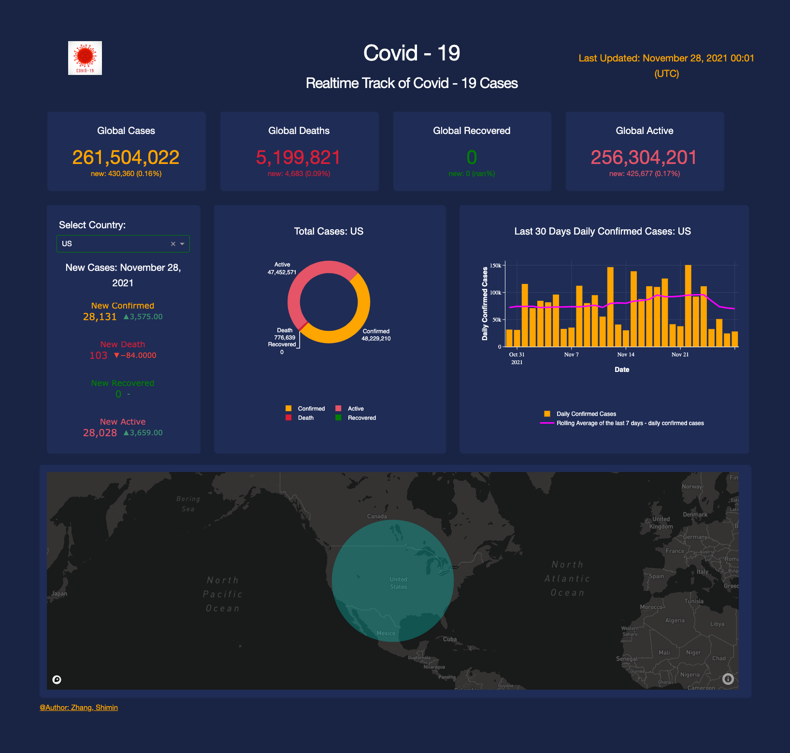
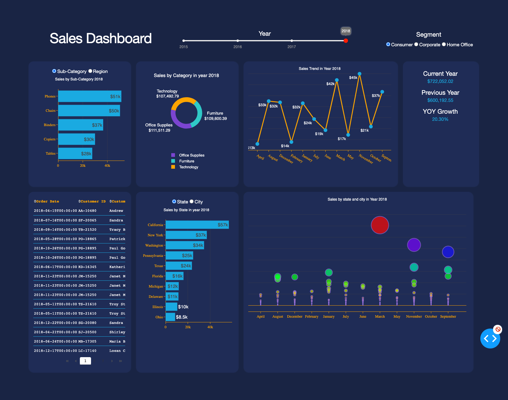

# DataVis

## Dashboard 1: Dynamic webpage to track the Covid-19 cases
Free deployment with Heroku 😼

[Real-Time Webpage to Track Corona-19](https://covidtrackdashboard.herokuapp.com)

Run on local machine:
1. Install the packages in the `requirements.txt`
2. Set up you own mapbox API key from [mapbox](https://www.mapbox.com/)
3. Change the accesstoken to your own API key from mapbox
4. Now run: `python app.py` 👊 

#### Overview

## Dashboard 2: Interactive Sales Dashborad 

[Click to see the webpage](https://git.heroku.com/salesdashboardsales.git) ☕ 

#### Overview

